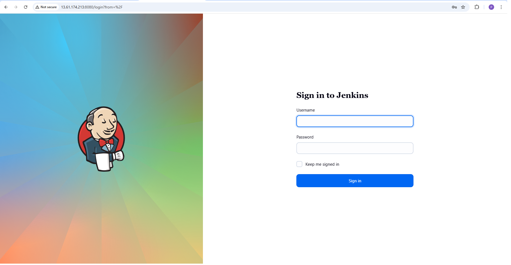
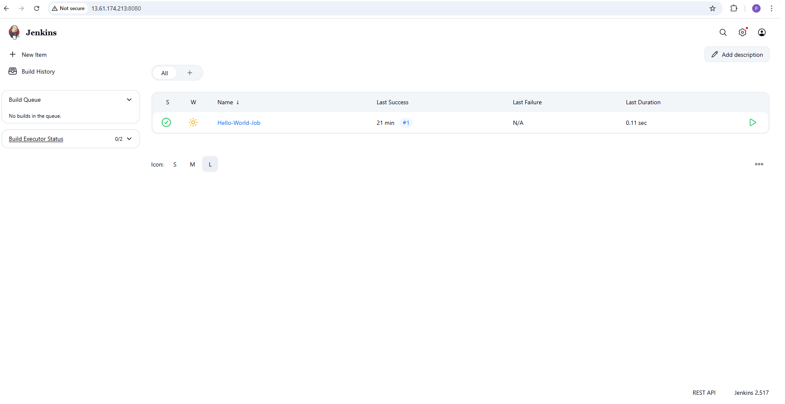
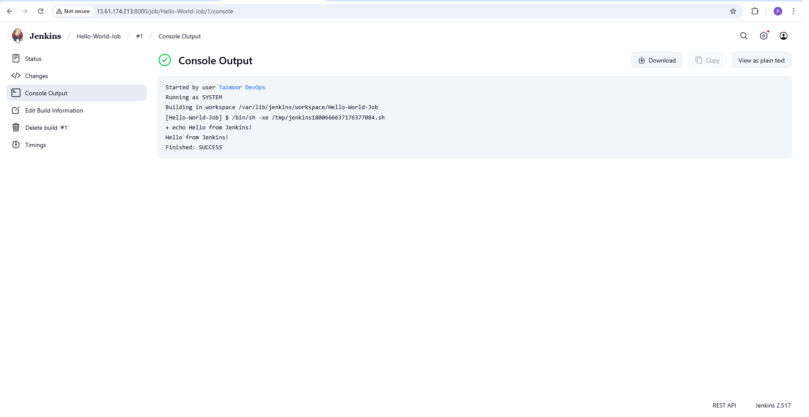

# Project 3: Jenkins EC2 Setup for CI/CD Demonstration 🚀

This project demonstrates how to install and configure a Jenkins server on an AWS EC2 instance to simulate a basic Continuous Integration (CI) environment. It forms part of my practical AWS & DevOps learning journey.

---

## 🌐 Project Overview

- Launch EC2 (Ubuntu 22.04)
- Install Java & Jenkins
- Open required ports (22, 8080)
- Access Jenkins UI via public IP
- Create and run a sample Jenkins Job
- Understand the basics of Jenkins CI pipelines

---

## 📦 Tech Stack

- AWS EC2 (t3.micro, Free Tier)
- Ubuntu 22.04 LTS
- Jenkins 2.x
- OpenJDK 17
- Basic Security Groups & SSH

---

## 🛠️ Setup Summary

### EC2 Instance

- Region: `eu-north-1 (Stockholm)`
- OS: Ubuntu 22.04 LTS
- Security Group:
  - Port 22: SSH (restricted to my IP)
  - Port 8080: Jenkins Web UI (open to all for demo purposes)

---

## ⚙️ Jenkins Installation Steps

```bash
# Update & Upgrade
sudo apt update && sudo apt upgrade -y

# Install Java (required for Jenkins)
sudo apt install openjdk-17-jdk -y

# Add Jenkins key & repository
curl -fsSL https://pkg.jenkins.io/debian/jenkins.io-2023.key | sudo tee /usr/share/keyrings/jenkins-keyring.asc > /dev/null
echo "deb [signed-by=/usr/share/keyrings/jenkins-keyring.asc] https://pkg.jenkins.io/debian binary/" | sudo tee /etc/apt/sources.list.d/jenkins.list > /dev/null

# Install Jenkins
sudo apt update
sudo apt install jenkins -y

# Start & Enable Jenkins
sudo systemctl enable jenkins
sudo systemctl start jenkins

# Verify Jenkins Status
sudo systemctl status jenkins
```
### 🔐 Initial Setup

Access Jenkins at: https://<your-public-ip>:8080
Unlock Jenkins with the admin password:

```
sudo cat /var/lib/jenkins/secrets/initialAdminPassword
```

Follow the guided setup:
- Install recommended plugins
- Create the first admin user (fake email taimoor@mydevopslab.com used for demo purposes)
 
### 🏗️ Create & Run First Jenkins Job

- Created a simple "Hello World" Freestyle Job
- Confirmed successful build via Console Output

### 📸 Screenshots

**Step 1 - Jenkins Installed**  
  

**Step 2 - Jenkins Dashboard**  
  

**Step 3 - Hello World Job Success**  
 

📝 Notes
---
- Port 8080 open to all for demonstration — not recommended for production
- Basic EC2 security hardening applied
- Jenkins installed on Ubuntu 22.04 on Free Tier EC2

